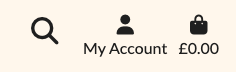

# **String Theory**

String Theory is a premium online guitar store.

To view the site as a super user as if you were the shop owner, use the following details (please don't delete user):

Email - CodeInstitute@google.com
Password - CodeInstitute2025

This is an example project not built for real credit card transactions. To test the functionality use the below number

```
Test card number: 4242 4242 4242 4242
Expiry date: 04 / 26
CVC :242
Zip code: 42424
```


Link to the page: [String Theory](https://string-theory-60d2d98dc791.herokuapp.com/)

## Project Overview

- I built this site as a dedicated guitar shop focused on showcasing a selection of Fender and Gibson electric guitars. Users can easily browse and compare different models with a simple, streamlined filtering system. The site includes a responsive design for all screen sizes, an intuitive search bar, and dedicated sections for a blog and customer testimonials. The ‘About Us’ page is a static HTML file, while the blog and testimonials have their own Django apps. This project follows a test-driven development approach, ensuring reliability and scalability.

## Table of Contents:

1. [**String Theory**](#string-theory)
2. [**Planning stage**](#planning-stage)
   - [_Target Audiences_](#target-audiences)
   - [_User Stories_](#user-stories)
   - [_Site Aims_](#site-aims)
   - [_How Will This Be Achieved_](#how-will-this-be-achieved)
   - [_Research_](#research)
   - [_Inspiration_](#inspiration)
   - [_Wireframes_](#wireframes)
   - [_Colour Scheme And Theme_](#colour-scheme-and-theme)
   - [_Typography_](#typography)
3. [**Back End**](#back_end)
   - [_models.py_](#models.py)
   - [_routes.py_](#routes.py)
4. [**Front End**](#front_end)
   - [_Design_](#design)
   - [_Nav Bar_](#nav_bar)
   - [_Sign Up and Login_](#sign_up_and_login)
   - [_New Date Idea_](#new_date_idea)
   - [_Pick A Date_](#pick_a_date)
   - [_View All_](#view_all)
   - [_Add partner_](#add_partner)
   - [_Delete User_](#delete_user)
   - [_Tab Icon_](#tab_icon)
   - [_404_](#404)
5. [**Testing**](#testing)
   - [_Validator Testing_](#validator-testing)
6. [**Future Enhancements**](#future-enhancements)
7. [**Credits**](#credits)
   - [_Honourable Mentions_](#honourable-mentions)
   - [_General Reference_](#general-refrence)
   - [_Content_](#content)
   - [_Media_](#media)

# Planning stage

### Target User

- The target audience for this site will be people looking to purchase a high-end guitar from one of the 2 majour brands in the space, they will be looking to either purchase products for themselves or as a gift.

- The target audience will also be someone looking to read up on the latest news and tips surrounding either music or the products.

### User Stories

#### 1. Viewing And Navigation

1. I want it to be easy and intuitive to register, login and logout.
2. I want it to be easy and intuitive to access my profile.
3. I want it to be easy and intuitive to access my bag/cart.
4. I want to be notified when I click on something that performs an action (i.e adding to cart) and the action is successful.
5. I want to be notified when I click on something and the action is _not_ successful.
6. I want to be able to navigate the site easily.
7. I want to access all portions of the site from the homepage.
8. I want to not use the browsers back button.

#### 2. Product Viewing, Searching And Selecting

1. I want to see all available products on a single page.
2. I want to be able to quickly and easily access any information for a product I find.
3. I want to be able to search for a product both directly by name or buy a character trait such as colour or material.
4. I want to be able to sort product based on price, rating, name or category.
5. I want to see a rating for the product.
6. I want to see all details that would interet me when purchasing a guitar or accessory.
7. I want other products to be suggested to me based on the product I am currently viewing.
8. I want to be able to add items to my bag/cart.
9. I want to be able to delete items from my bag/cart.
10. I want an estimated shipping date.

#### 3. Selecting, Purchasing Products And Checkout

1. I want to be able to see what products I have selected both in my card and when checking out.
2. I want to be able to see the individual cost of the items in my bag/cart.
3. I want to be able to see the total cost of my bag/cart.
4. I want a notification informing me if a item has been added to my bag/cart.
5. I want a notification informing me if a item has been removed from bag/cart.
6. I want a notification informing me if a item quantity has been changed in my bag/cart.
7. I want to see my previous purchases.
8. I want to be able to save my delivery information.
9. I want to be able to see a preview of my products before I confirm the payment.
10. I want the payment to be safe and secure.
11. I want email confirmation my purchase has been successful.
12. I want to be able to buy products even when I am not registered.

#### 4. Product management (admin only)

1. I want to be able to add products on the website and database, including all information and images.
2. I want to be able to edit products on the website and database.
3. I want to be able to delete products on the website and database.

#### 5. User’s activity management (admin only)

1. I want users to register and create their account.
2. I want users to have pleasant experience on my site and make it easy for them to purchase product.
3. I want users to be able to access my site on variety of devices of all sizes.
4. I want users to be able to access my site on variety of browsers.
5. I want non logged in users not to gain access to any aspects of the site that invloves a login.
6. I want non logged in users to be given the option to make an account after a purchase.
7. I want the user to be notified when the payment details they provided are not correct.
8. I want the payment method to be setup correctly to stop an order being placed without payment or payment being provided without an order being placed.

# Research

## https://www.kennysmusic.co.uk/

A chain of music stores across Scotland, offering numerous different instruments and accessories.

### Like:

- The brand logos are displayed in the navbar drop downs.
- Navbar drop down also greys out page
- Items in shop let you see if it's in stock

### Dislike:

- Very busy site, a lot of different parts of the page moving and trying to get your attention.
- Large drop downs that block information
- Nearly everything has a hover animation, entire page can change when rolling mouse over site

## https://www.gibson.com/en-GB

A high end guitar brand that make and sell guitars and guitar accessories.

### Like:

- Muted colours
- Simple design
- Item viewing pleasant experience
- Smart navbar

### Dislike:

- Homepage really long, trying to display too much
- No back to top button

## https://www.fender.com/en-GB/start

A high end guitar brand that make and sell guitars and guitar accessories.

### Like:

- Very professional styling
- Hero image helps keep first impressions good, rotates after a few seconds showcasing guitars
- Search bar always at top, visible at all sizes. Dropdowns rotate into

### Dislike:

- No back to top button on long pages

## https://www.gear4music.com/

An online music store offering all kinds of instruments and accessories.

### Like:

- Shop has a nice tile format
- Give exact stock quantities when browsing store
- Offers numerous pictures
- Gives Key features for quick browsing

### Dislike:

- Very busy site
- Drop downs in Navbar are huge, each one offering up to and over 100 options
- Long specifications

## https://www.peachguitars.com/

A Website for a small guitar shop.

### Like:

- Dark tones, helps info and images pop
- Nice colour scheme
- Displays brand logos, helps people find know products
- Allows to search by brand, giving a short synopsis on the company.

### Dislike:

- Has a header fixed to top of page with brands and reviews, looks unprofessional.
- Has a banner that rotates every couple of seconds, can't see all information shown quick enough.
- Search bar expands removing all buttons
- Hover effect on all images, meaning the site actively changes as you move your curson.

After reviewing competing websites, I was confident that I could create something with a more modern and professional feel. Initially, my vision for my site was heavily inspired by e-commerce platforms that I use regularly, so I decided to review sites outside of the music equipment space. When viewing sites such as Asos and Boohoo (2 large online fashion retailers), I quickly found something closer to what I was imagining, with large hero images advertising the latest product with minimal text, letting the product sell itself. Simple navigation bars that span the screen and muted colours keep the attention on the product; these will be where I draw my inspiration from moving forward.

In conclusion to my research, I realised that I wanted something much more modern, using more minimalistic ideas and principles. A keen focus on the use of white space and having a limited colour palette with legible typography, ensuring functional navigation design and bold alignment to draw attention to the products being sold.

# Design

## Design choices

The site will be visited by people who are looking for products made of natural ingredients which could help with their health or skin problems. Therefore, the design elements evoke the feeling of nature and purity as well as solution to their problems.

## Colour Scheme


My inspiration for the colour scheme was taken from the very products themselves. I took numerous hex values from classic Fender and Gibson guitars, played around with brightness and tones and came to the pallete below.

I chose a simple off white background for my site, I think a light pale background gives a much more proffesional feel which I noted early on in my research.


The black both contrasts well with the off white background but it is also taken from the classic black les paul, along with the gold highlights being from that same guitar, with the golden details such as pickups.

The red and orange are taken from the Fender telecasters in rim of the original "sunburst" colour way from the late 50's.

## Typography

My inspiration for the logo font was the actualy both of Fender and Gibson logos, both fonts iconic and timeless. I was looking for something artistic and retro like Fender, but bold and legible like Gibson, I finally settled on
[Lobster](https://fonts.google.com/specimen/Lobster?preview.text=Welcome%20to%20String%20Theory%20&query=Lobster).

Keeping with google fonts I was able to quickly identify the font I wanted to use for the main body of text, unfortentley having picked it and thinking I found a real gem I realised it was the same font used in the Project 'Boutique Ado'. I selected [Lato](https://fonts.google.com/specimen/Lato?preview.text=Welcome%20to%20String%20Theory%20&query=lato) as its professional and easy to read.

# Database Schema

## Database Schema


# Wireframes

To organize my thoughts and prevent scope creep, I created a wire frame for this project. Below are the links to each of the mobile, tablet and desktop versions of the site.

## Mobile

<details>
<summary>Overview</summary>
<br>


</details>

<details>
<summary>Home Page</summary>
<br>


</details>

<details>
<summary>Menu</summary>
<br>


</details>

<details>
<summary>Menu Expanded</summary>
<br>


</details>

<details>
<summary>Search View</summary>
<br>


</details>

<details>
<summary>Search Recent</summary>
<br>


</details>
<details>
<summary>All Products</summary>
<br>


</details>

<details>
<summary>Product Detail</summary>
<br>


</details>

<details>
<summary>Product Full Screen</summary>
<br>


</details>

<details>
<summary>Cart</summary>
<br>


</details>

<details>
<summary>Empty Cart</summary>
<br>


</details>

<details>
<summary>Checkout</summary>
<br>


</details>

<details>
<summary>Place Order</summary>
<br>


</details>

<details>
<summary>About Us</summary>
<br>


</details>

</details>

<details>
<summary>Contact Us</summary>
<br>


</details>

<details>
<summary>Blog</summary>
<br>


</details>

<details>
<summary>Blog Detail</summary>
<br>


</details>

## Tablet

<details>
<summary>Overview</summary>
<br>


</details>

</details>

<details>
<summary>Home Page</summary>
<br>


</details>

<details>
<summary>Menu</summary>
<br>


</details>

<details>
<summary>Menu Expanded</summary>
<br>


</details>

<details>
<summary>Search View</summary>
<br>


</details>

<details>
<summary>Search Results</summary>
<br>


</details>
<details>
<summary>All Products</summary>
<br>


</details>

<details>
<summary>Product Detail</summary>
<br>


</details>

<details>
<summary>Product Full Screen</summary>
<br>


</details>

<details>
<summary>Cart</summary>
<br>


</details>

<details>
<summary>Empty Cart</summary>
<br>


</details>

<details>
<summary>Checkout</summary>
<br>


</details>

<details>
<summary>About Us</summary>
<br>


</details>

</details>

<details>
<summary>Contact Us</summary>
<br>


</details>

<details>
<summary>Blog</summary>
<br>


</details>

<details>
<summary>Blog Detail</summary>
<br>


</details>

## Desktop

<details>
<summary>Overview</summary>
<br>


</details>

<details>
<summary>Home Page</summary>
<br>


</details>

<details>
<summary>All Products</summary>
<br>


</details>

<details>
<summary>Product Details</summary>
<br>


</details>

<details>
<summary>Checkout</summary>
<br>


</details>

<details>
<summary>Search</summary>
<br>


</details>

</details>

<details>
<summary>Blog</summary>
<br>


</details>

<details>
<summary>Blog Detail</summary>
<br>


</details>

Moving into this project I decided to invest a large amount of time into my wireframes, using Figma

# Features

## Header

- INPUT INFO HERE

### Desktop Header

<details>
<summary>Desktop Header</summary>
<br>


</details>

<details>
<summary>Desktop Header Dropdown</summary>
<br>


</details>

<details>
<summary>Desktop Navbar Dropdown</summary>
<br>


</details>

</details>

<details>
<summary>Search</summary>
<br>



</details>

<details>
<summary>Search Bar Expanded</summary>
<br>


</details>

<details>
<summary>Gold Hover</summary>
<br>


</details>

<details>
<summary>My Account Dropdown</summary>
<br>


</details>

### Mobile Header

<details>
<summary>Mobile Header</summary>
<br>


</details>

<details>
<summary>Mobile Dropdown</summary>
<br>


</details>

<details>
<summary>Mobile Dropdown Extended</summary>
<br>


</details>

## Footer

<details>
<summary>Desktop Footer</summary>
<br>


</details>

<details>
<summary>Mobile Footer</summary>
<br>


</details>

## Home Page

### Hero Image

- INPUT INFO HERE

<details>
<summary>Desktop Hero Image</summary>
<br>


</details>

<details>
<summary>Mobile Hero Image</summary>
<br>


</details>

### Brands and Collections

<details>
<summary>Desktop Brands</summary>
<br>


</details>

<details>
<summary>Mobile Brands</summary>
<br>


</details>

<details>
<summary>Desktop Collections</summary>
<br>


</details>

<details>
<summary>Mobile Brands</summary>
<br>


</details>

### New Arrivals

<details>
<summary>Desktop Hero Image</summary>
<br>


</details>

<details>
<summary>Mobile Hero Image</summary>
<br>


</details>

### Follow Us

<details>
<summary>Desktop Follow Us</summary>
<br>


</details>

<details>
<summary>Mobile Follow Us</summary>
<br>


</details>

## Registration page

### Registration Form

- INPUT INFO HERE

<details>
<summary>Sign Up</summary>
<br>


</details>

## Sign In/ Sign out page

### Sign in Form

- INPUT INFO HERE

<details>
<summary>Sign In</summary>
<br>


</details>

### Sign out

- INPUT INFO HERE

<details>
<summary>Sign Out</summary>
<br>


</details>

## Products

- INPUT INFO HERE

### All Products

- INPUT INFO HERE

<details>
<summary>All Products</summary>
<br>


</details>

- INPUT INFO HERE

<details>
<summary>All Products Title</summary>
<br>


</details>

- INPUT INFO HERE

<details>
<summary>All Products Order</summary>
<br>


</details>

### Product Description

- INPUT INFO HERE

<details>
<summary>Desktop Product Description</summary>
<br>


</details>

<details>
<summary>Mobile Product Description</summary>
<br>


</details>

<details>
<summary>Details Accordion</summary>
<br>


</details>

### You May Also Like

- INPUT INFO HERE

<details>
<summary>You May Also Like</summary>
<br>


</details>

### Add product (admin only)

- INPUT INFO HERE

<details>
<summary>Add Product</summary>
<br>


</details>

### Edit product (admin only)

- INPUT INFO HERE

<details>
<summary>Edit Product</summary>
<br>


</details>

## Blog

- INPUT INFO HERE


### Add Blog (Admin Only)

- INPUT INFO HERE

### Edit Blog (Admin Only)

- INPUT INFO HERE

## Contact Us and About Us

- INPUT INFO HERE


## All products page

### Card

- INPUT INFO HERE


## Profile page

- INPUT INFO HERE


## Bag

- INPUT INFO HERE

## Checkout

- INPUT INFO HERE

## Checkout success

- INPUT INFO HERE

## Message section

- INPUT INFO HERE

## Future implementations

With more time and experience I would like to implement the following:

- [CKEditor](https://ckeditor.com/) is a rich text editor for web applications that provides a WYSIWYG interface for creating and formatting content which can be integrated into Django, using this for the blogs would have realised my vision for how I wanted the blog to be viewed after entry, with spacing and images being placed in a classic blog format.

- Allowing a quantity of products to be selected before adding to the bag, currently a customer would need to view the bag to increase the quantity, though not breaking the customer experience as the site is dedicated to large single ticket items I feel it looks unproffesional.

- The horizontal rule that I generated with the help of [CodePen](https://codepen.io/szpakoli/pen/zYKqoJ), I modified it into a near perfect replica of what I generated in my Figma file, but at somepoint during the build process the diamond was flattened and after numerous attempts to fix I decided to leave.

# Technologies Used

## Languages Used

- HTML
- CSS
- Javascript
- Python

## Frameworks, libraries, Online tools and Programs used

- [Django](https://www.djangoproject.com/) - Django is a high-level Python web framework that enables rapid development of secure and scalable web applications.
- [AWS3](https://aws.amazon.com/)
- [Stripe](https://stripe.com/gb)
- [GitHub](https://github.com/vero-nika-2828/yasmin-jas-photography) - To save and store my files in a public repository.
- [VScode](https://code.visualstudio.com/) - My choice of IDE.
- [Heroku](https://dashboard.heroku.com/) - The deployment platform for this project.
- [SQLite](https://www.sqlite.org/) - The default SQL backend database engine for Django.
- [Bootstrap5](https://getbootstrap.com/) - used for responsiveness and styling of the website.
- [jQuery](https://jquery.com/) -used to simplify JavaScript code.
- [Google Fonts](https://fonts.google.com/) - For the typography on the website.
- [Font Awesome](https://fontawesome.com/) - For the iconography on the website.
- [Figma](https://www.figma.com/) - Used to create my initial designs.
- [drawSQL](https://drawsql.app/) - To create database schema.
- Google Dev Tools - To troubleshoot and test features, solve issues with responsiveness and styling.
- Apple preview - To manipulate images and reduce file sizes.
- [FreeConvert](https://www.freeconvert.com/webp-converter/download) - converted the numerous image files types to WebP
- [Am I Responsive](https://ui.dev/amiresponsive) - To show the website image on a range of devices.

# Testing

Find the full testing documented in [TESTING.md](TESTING.md).

# Deployment & local development

Please refer to [DEPLOYMENT.md](DEPLOYMENT.md) if you wish to deploy a copy of the site for yourself.

# Credits

### Code

- This project was created following Code Institute's Boutique Ado project

### Images

- All Blog images were free downloads from [Pexels](https://www.pexels.com/)

- All product images were taken from the [Fender](https://www.fender.com/) product website and [Gibson](https://www.gibson.com/) product website.

### Content

- Product details and blogs were generated by [ChatGPT](https://chat.openai.com/) via the fixtures file.

# Acknowledgement

I would like to thank to following people who helped me along the way in completing this project:

- My Code Institute mentor, Richard Wells, for his valuable advice and helping me work to industry standard.
- My tutor for pushing me to go the extra mile.
- My fiance Jessica for supporting me through the many long nights of debugging.
