# Testing

## Automated Testing

### Python Testing

Going into this project I wanted to ensure I was following industry practices as best as possible, I knew about the importance of TDD (Test Driven Development) but has to research exactly how to do it for a project of this size and more often than not when put into practice I would find myself struggling to get tests to pass due to me actually making mistakes within my tests. To counter this I did a lot of reading, I would often use an LLM to bounce ideas off to help me brainstorm and decipher error codes and I included _A LOT_ of comments which were often simple things to help me keep track. Below is an example of my TDD on my blogs app:

This is just a small selection of the testing done, I actually wrote a total of 68 tests for all aspects of my site, below is the coverage achieved.

I was focused on testing the code I had written, so a large aspect of the code untested is from Django which has already been tested by the developers. I attempted the Webhooks but at this current moment in time I do not have the skill set or time to test those properly.

### CSS Validator ([W3C](https://jigsaw.w3.org/css-validator/))

1 error initially found where my font-size on my title class was missing the word "font", after this change none were found on any page.

Home Page

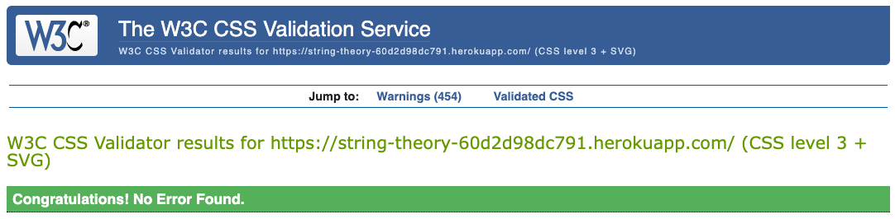

All Products

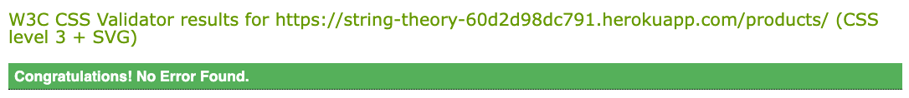

Product Details

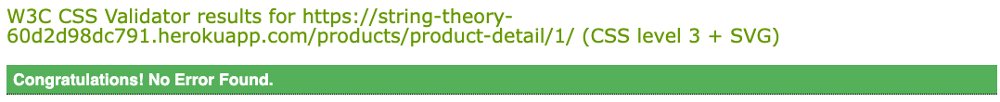

Contact Us

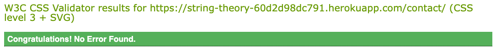

About Us

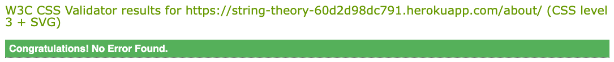

Blog

Bag

Profile

Checkout

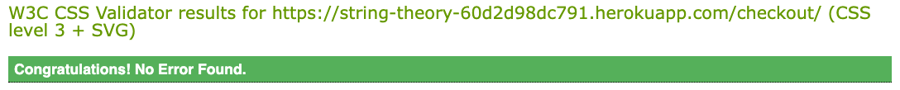

### HTML Validator ([W3C](https://validator.w3.org/))

Running the home page first I found 26 Errors:

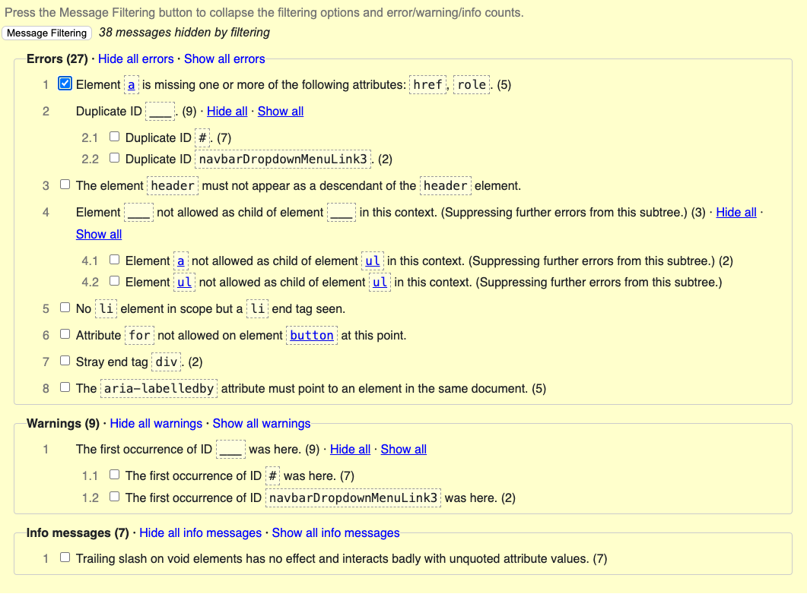

After going through the list I found that some were duplicate ID's from bootstrap boilerplate which I used as a framework, a header element nested inside another element due to it being inside a "includes" and a rather frustrating ul/li nesting problem which I was unable to resolve. After a large amount of testing I could see no harm caused by the issue but it will need to be resolved.

After doing my best to fix the issues I was able to get it down to 7 Errors:

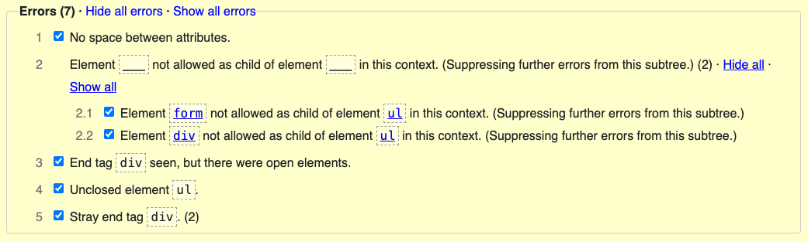

### Javascript Validator ([JShint](https://jshint.com/))

The following shows the results for all the Javascript in my site.

Bag

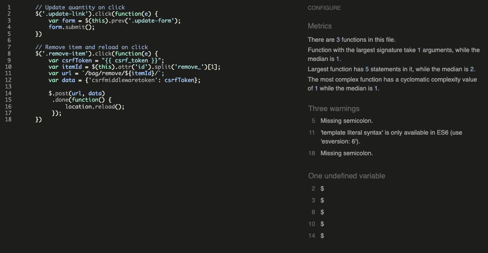

Blog

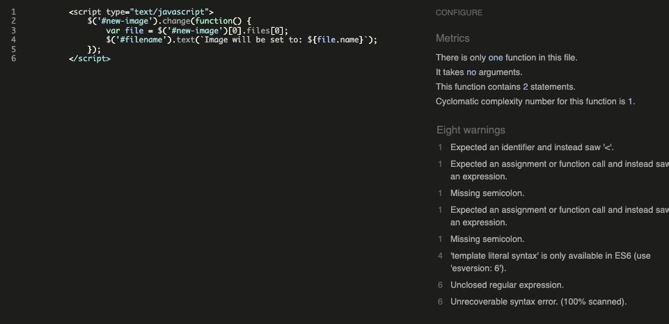

Country Field On Profile Form

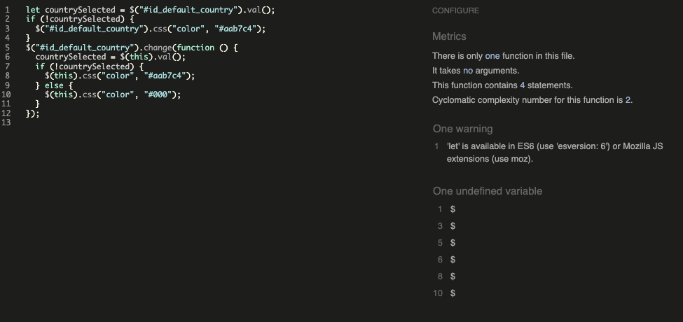

Search Bar And Product Details Page

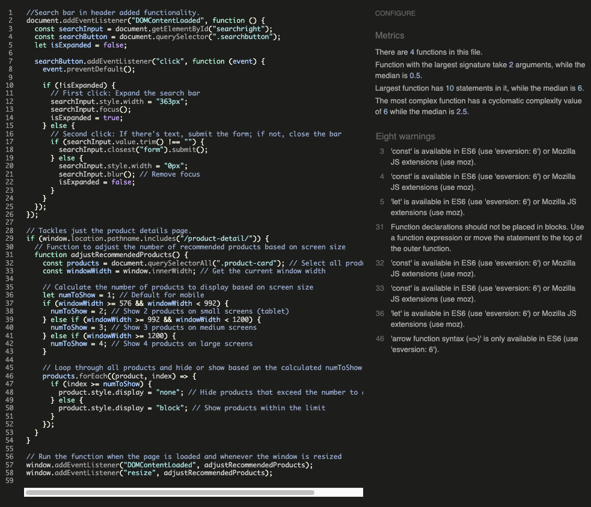

All Products Sort

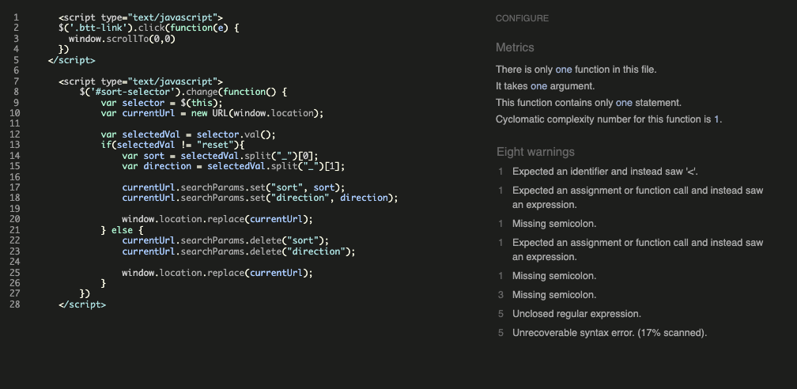

Stripe

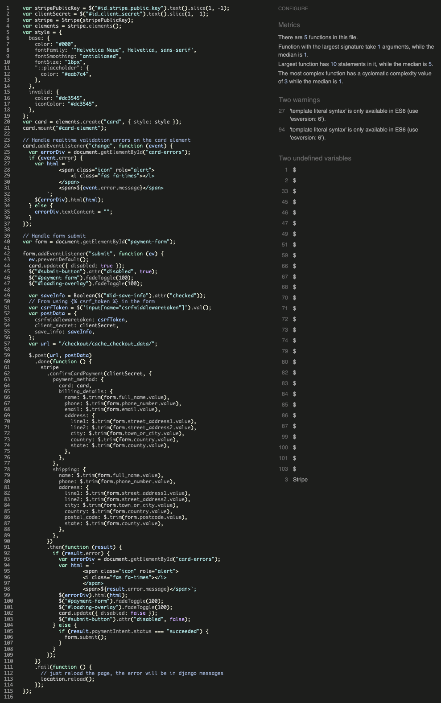

Toasts

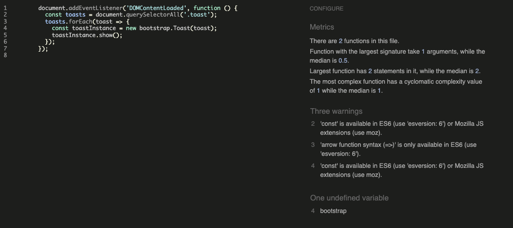

Only warnings, a large portion of which was due to me copying in HTML as a lot of the JS supplied was in the postloadjs block

### Lighthouse

Home Page

 
Desktop:

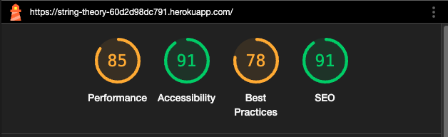

Mobile:

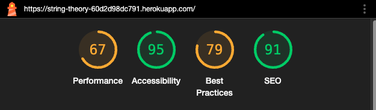

All Products

 
Desktop:

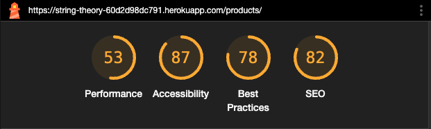

Mobile:

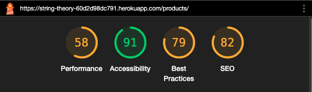

Product Details

 
Desktop:

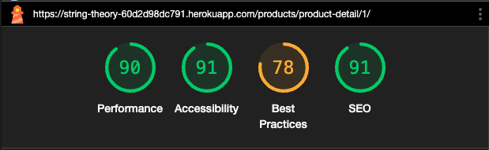

Mobile:

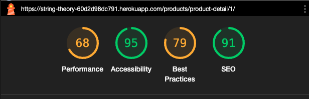

Contact Us

 
Desktop:

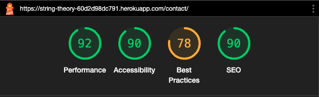

Mobile:

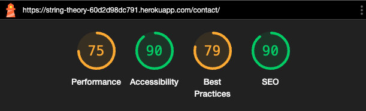

About Us

 
Desktop:

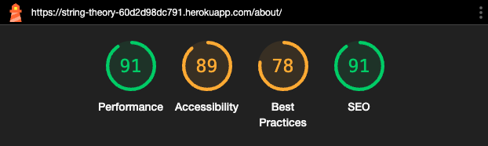

Mobile:

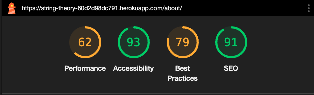

Blog

 
Desktop:

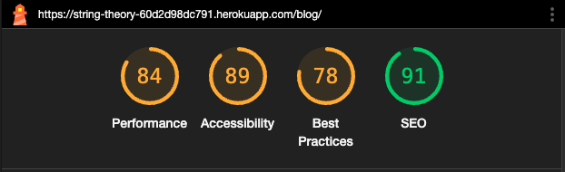

Mobile:

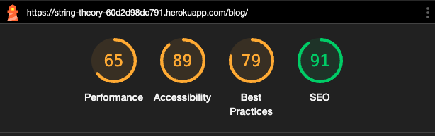

Bag

 
Desktop:

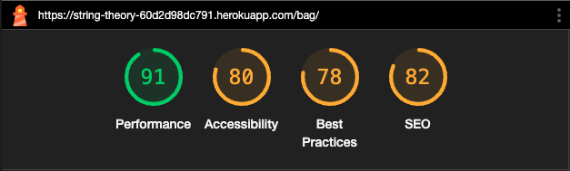

Mobile:

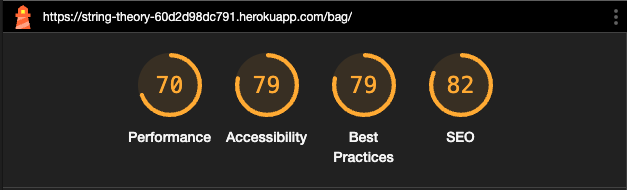

Profile

 
Desktop:

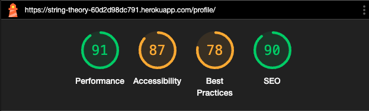

Mobile:

Checkout

 
Desktop:

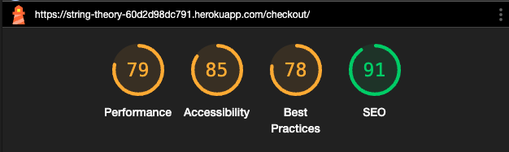

Mobile:

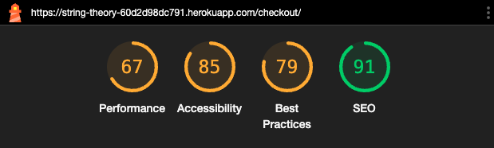

 

The lighthouse testing highlighted a few issues with my site, the large quantity of images being loaded really slows my site down.

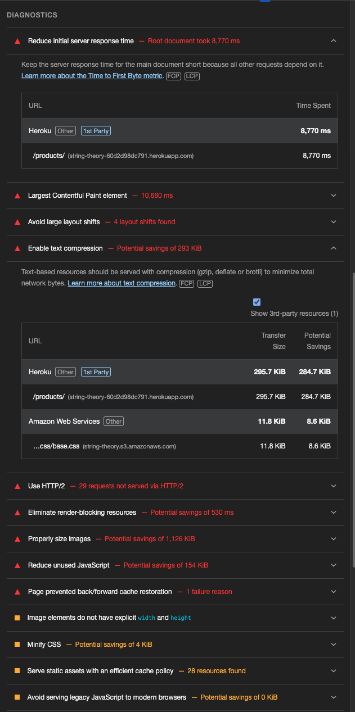

Heroku and AWS being 2 of the key reasons for the performance issues.

## Manual testing

Manual testing was performed on following devices

- Laptop:

  - Apple MacBook Air

- Mobile phone:

  - iPhone 15 pro max
  - iPhone 13

- Notepad:
  - Apple iPad mini

Full testing was performed on following web browsers:

- Arc
- Chrome
- Mozilla Firefox
- Microsoft Edge
- Microsoft Explorer
- Safari

The site was given to friends and family on numerous devices, on the whole I didn't get any feedback concerning bugs.

## Known Bugs

- The mobile header uses a Bootstrap Navbar to be responsive, I have accidentally taken the template from the site and changed the order to fit my needs, nesting unordered lists inside of lists. When I went to correct it broke the page, this would be due to a CSS class im sure but I will need to review and resolve.

- Images not always being rendered on site, it doesn't always happen and I had to spend a long time investigating a way around this. I was able to get it working using URL's of the SW3 bucket but that wasn't always repeatable and on one occasion I saw one image (not being displayed) showing as a PNG in dev tools while the actual HTML and SW3 bucket was WebP.

- Not really a bug but the lighthouse highlighted issues with speed and accessibility which I would like to resolve.
