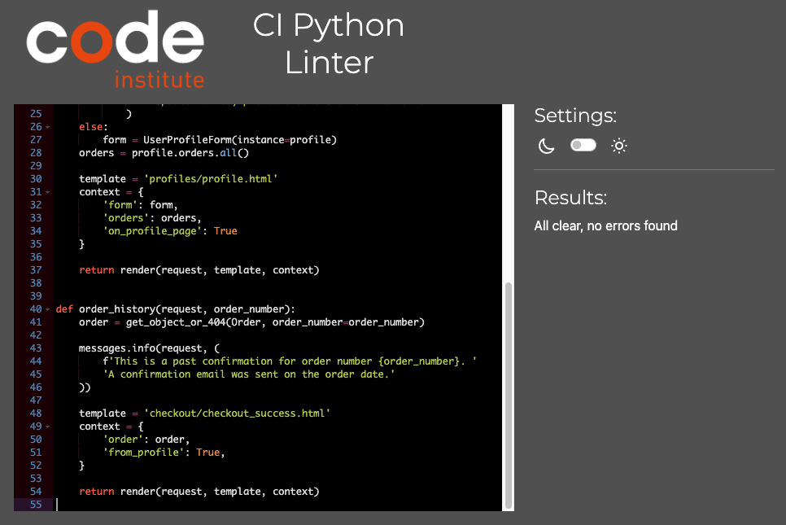

# Testing

## Automated Testing

### Python Testing

Going into this project I wanted to ensure I was following industry practices as best as possible, I knew about the importance of TDD (Test Driven Development) but has to research exactly how to do it for a project of this size and more often than not when put into practice I would find myself struggling to get tests to pass due to me actually making mistakes within my tests. To counter this I did a lot of reading, I would often use an LLM to bounce ideas off to help me brainstorm and decipher error codes and I included _A LOT_ of comments which were often simple things to help me keep track. Below is an example of my TDD on my blogs app:

This is just a small selection of the testing done, I actually wrote a total of 68 tests for all aspects of my site, below is the coverage achieved.

I was focused on testing the code I had written, so a large aspect of the code untested is from Django which has already been tested by the developers. I attempted the Webhooks but at this current moment in time I do not have the skill set or time to test those properly.

- PEP8 Validator (https://pep8ci.herokuapp.com/) -pass

    

    
.py files -pass

     

  

    

      The files which were tested and associated apps are listed below

      Bag App:
        • admin.py
        • apps.py
        • contexts.py
        • models.py
        • urls.py
        • views.py

      Blog App:
        • admin.py
        • apps.py
        • forms.py
        • models.py
        • urls.py
        • views.py

      Checkout App:
        • admin.py
        • apps.py
        • forms.py
        • models.py
        • signals.py
        • urls.py
        • views.py

      Home App:
        • apps.py
        • urls.py
        • views.py

      Products App:
        • admin.py
        • apps.py
        • context_processors.py
        • forms.py
        • models.py
        • urls.py
        • views.py
        • widgets.py

      Profiles App:
        • apps.py
        • forms.py
        • models.py
        • urls.py
        • views.py

### CSS Validator ([W3C](https://jigsaw.w3.org/css-validator/))

1 error initially found where my font-size on my title class was missing the word "font", after this change none were found on any page.

Home Page

All Products

Product Details

Contact Us

About Us

Blog

Bag

Profile

Checkout

### HTML Validator ([W3C](https://validator.w3.org/))

Running the home page first I found 26 Errors:

After going through the list I found that some were duplicate ID's from bootstrap boilerplate which I used as a framework, a header element nested inside another element due to it being inside a "includes" and a rather frustrating ul/li nesting problem which I was unable to resolve. After a large amount of testing I could see no harm caused by the issue but it will need to be resolved.

After doing my best to fix the issues I was able to get it down to 7 Errors:

### Javascript Validator ([JShint](https://jshint.com/))

The following shows the results for all the Javascript in my site.

Bag

Blog

Country Field On Profile Form

Search Bar And Product Details Page

All Products Sort

Stripe

Toasts

Only warnings, a large portion of which was due to me copying in HTML as a lot of the JS supplied was in the postloadjs block

### Lighthouse

Home Page

 
Desktop:

Mobile:

All Products

 
Desktop:

Mobile:

Product Details

 
Desktop:

Mobile:

Contact Us

 
Desktop:

Mobile:

About Us

 
Desktop:

Mobile:

Blog

 
Desktop:

Mobile:

Bag

 
Desktop:

Mobile:

Profile

 
Desktop:

Mobile:

Checkout

 
Desktop:

Mobile:

 

The lighthouse testing highlighted a few issues with my site, the large quantity of images being loaded really slows my site down.

Heroku and AWS being 2 of the key reasons for the performance issues.

## Manual testing

Below I go through my user stories and log what I did to prove I have successfully covered them in my site, user stories with similar paths I have combined.

#### **1. Viewing and Navigation:**

| Passed  | **I want it to be easy and intuitive to register, login and logout**              |
| :-----: | :-------------------------------------------------------------------------------- |
| &check; | I am able to register a new account.                                              |
| &check; | I am able to login to the account just made after receiving a confirmation email. |
| &check; | I am able to logout of the account.                                               |

| Passed  | **I want it to be easy and intuitive to access my profile, Bag** |
| :-----: | :--------------------------------------------------------------- |
| &check; | I am able to easily find and access my profile.                  |
| &check; | I am able to easily find and access my bag.                      |

| Passed  | **I want to be notified when I click on something that performs an action (i.e adding to cart) and the action is successful, also when its not successful** |
| :-----: | :---------------------------------------------------------------------------------------------------------------------------------------------------------- |
| &check; | When adding an item to my bag I get a notification.                                                                                                         |
| &check; | When changing my item quantity I get a notification.                                                                                                        |
| &check; | When logged in as a super user, I can try to add an a product without filling in all necessary fields.                                                      |

| Passed  | **I want to be able to navigate the site easily. from the home page, without using the back button** |
| :-----: | :--------------------------------------------------------------------------------------------------- |
| &check; | Navbar gives me options for all pages.                                                               |
| &check; | Icons in header gives me options for logging in, registering and logging out, along with the bag     |
| &check; | Burger menu on mobile gives me options for all pages.                                                |
| &check; | I am able to get back to any part of the site I was on without pressing back in the browser.         |

#### **2. Product Viewing, Searching And Selecting:**

| Passed  | **I want to see all available products on a single page, I want to be able to quickly access any information for a product I find** |
| :-----: | :---------------------------------------------------------------------------------------------------------------------------------- |
| &check; | Using the navbar I can access all products.                                                                                         |
| &check; | Using the navbar I can access all products of one brand or type.                                                                    |
| &check; | When viewing all the products, I am able to click on an item card to get the product detail                                         |

| Passed  | **I want other products to be suggested to me based on the product im currently viewing **        |
| :-----: | :------------------------------------------------------------------------------------------------ |
| &check; | While viewing an item in detail, scrolling down will suggest other products in the same category. |

| Passed  | **I want to search for a product both directly by name or buy a character trait such as colour or material, and then sort by price or name ** |
| :-----: | :-------------------------------------------------------------------------------------------------------------------------------------------- |
| &check; | Using the search icon in the header I can search by keyword, if in either description, detail or description I will appear.                   |
| &check; | After searching I am able to sort by numerous traits.                                                                                         |

| Passed  | **I want to see all details that would be crucial when purchasing a guitar or accessory, including rating. I want to be able to see a estimated shipping date ** |
| :-----: | :--------------------------------------------------------------------------------------------------------------------------------------------------------------- |
| &check; | When viewing all products, the item card gives details such as price and rating.                                                                                 |
| &check; | When clicking on item card I am given all details about the product.                                                                                             |
| &check; | Scrolling down in the item card shows a accordion with details, clicking on the shipping gives an estimated date                                                 |

| Passed  | **I want to be able to add items to a bag or cart, and delete them from it **                                                                                                                    |
| :-----: | :----------------------------------------------------------------------------------------------------------------------------------------------------------------------------------------------- |
| &check; | When viewing an item I am able to click "Add to basket", I receive a notification that the item has been added and the icon in the header will turn blue, a total price will also appear beneath |
| &check; | When clicking on the icon to view the bag I am able to press delete to remove the item.                                                                                                          |
| &check; | While viewing the item in the bag I am able to change the quantity.                                                                                                                              |

#### **3. Selecting, Purchasing Products And Checkout:**

| Passed  | **I want to be able to see what products I have selected both in my cart and when checking out, along with individual and total costs **                                                          |
| :-----: | :------------------------------------------------------------------------------------------------------------------------------------------------------------------------------------------------ |
| &check; | After adding 2 or more items to my cart, im able to click the icon to see the individual item with some details. When clicking "Secure Checkout" I can see a minimised/preview version of my bag. |
| &check; | Both the cart and secure checkout have a cost breakdown of individual and total costs.                                                                                                            |

| Passed  | **I want a notification when a item is added to the cart, removed or changed **                                                                                  |
| :-----: | :--------------------------------------------------------------------------------------------------------------------------------------------------------------- |
| &check; | Each item added triggers a notification that it has entered my cart.                                                                                             |
| &check; | Going into the bag allows me to change the quantity, when changed it will trigger a new notification saying it was successful and will show me the new quantity. |
| &check; | Deleting the item will remove it from the bag, triggering a notification telling me it was successfully deleted.                                                 |

| Passed  | **I want to be able to save my delivery information, and see my previous purchases **                                                                        |
| :-----: | :----------------------------------------------------------------------------------------------------------------------------------------------------------- |
| &check; | After creating an account and logging in, I am able to go to my profile to save my delivery information.                                                     |
| &check; | After paying for my bag, if no information has been saved yet I am able to click a link that will save my delivery information I have just used when paying. |
| &check; | After paying for my bag, I am able to go to my profile see all my purchases.                                                                                 |

| Passed  | **I want to be able to buy an item without logging in and receive an email confirmation, all while being safe and secure ** |
| :-----: | :-------------------------------------------------------------------------------------------------------------------------- |
| &check; | Without logging in I can select a product and purchase it.                                                                  |
| &check; | Payment is transacted with stripe, I know this as a 3rd party pop up was needed for my banks approval on my phone.          |
| &check; | I received an email confirmation shortly after purchase.                                                                    |

#### **4. Product Management (admin only):**

| Passed  | **I want to be able to add, edit and delete products on the website and database, including all information and images **                                                                                    |
| :-----: | :----------------------------------------------------------------------------------------------------------------------------------------------------------------------------------------------------------- |
| &check; | As a superuser, I can click on the profile icon or burger menu and go to "Product Management", which will take me to a page allowing me to add an item will all possible detail fields and a image uploader. |
| &check; | As a superuser, I can log in and go to the all products tab where I can see 2 buttons allowing me to edit or delete an item.                                                                                 |

#### **5. User’s Activity Management (admin only):**

| Passed  | **A I want users to be able to access my site on variety of browsers and devices**.                   |
| :-----: | :---------------------------------------------------------------------------------------------------- |
| &check; | Users can access the site via the deployed URL on the desktop and all elements of the site are there. |
| &check; | Users can access the site via the deployed URL on mobile and all elements of the site are there.      |
| &check; | Users can access the site via the deployed URL on a tablet and all elements of the site are there.    |
| &check; | Users can access the site via the deployed URL on any browser.                                        |

| Passed  | **I want non logged in users not to gain access to any aspects of the site that involves a login**. |
| :-----: | :-------------------------------------------------------------------------------------------------- |
| &check; | Users are not given links to "logged in user" pages.                                                |
| &check; | If a user got the URL to a page requiring login, backend has measures to check and stop them.       |

| Passed  | **I want the user to be notified when the payment details they provided are not correct**.                               |
| :-----: | :----------------------------------------------------------------------------------------------------------------------- |
| &check; | Secure Checkout form checks if all fields are correctly filled in.                                                       |
| &check; | Stripe payment checks both address and card to see if correct/real.                                                      |
| &check; | Using Webhooks built into the site, admin can test to see if Stripe is getting correct information around order/payment. |

| Passed  | **I want the payment method to be setup correctly to stop an order being placed without payment or payment being provided without an order being placed**. |
| :-----: | :--------------------------------------------------------------------------------------------------------------------------------------------------------- |
| &check; | Using Webhooks built into the site, admin can test to see if Stripe is getting correct information around order/payment.                                   |
| &check; | Detailed messages inform Stripe console what happened, measures in place to stop payment if no order made or make or if payment completed.                 |

Manual testing was performed on following devices

- Laptop:

  - Apple MacBook Air

- Mobile phone:

  - iPhone 15 pro max
  - iPhone 13

- Notepad:
  - Apple iPad mini

Full testing was performed on following web browsers:

- Arc
- Chrome
- Mozilla Firefox
- Microsoft Edge
- Microsoft Explorer
- Safari

The site was given to friends and family on numerous devices, on the whole I didn't get any feedback concerning bugs.

## Known Bugs

- The mobile header uses a Bootstrap Navbar to be responsive, I have accidentally taken the template from the site and changed the order to fit my needs, nesting unordered lists inside of lists. When I went to correct it broke the page, this would be due to a CSS class im sure but I will need to review and resolve.

- Images not always being rendered on site, it doesn't always happen and I had to spend a long time investigating a way around this. I was able to get it working using URL's of the SW3 bucket but that wasn't always repeatable and on one occasion I saw one image (not being displayed) showing as a PNG in dev tools while the actual HTML and SW3 bucket was WebP.

- Not really a bug but the lighthouse highlighted issues with speed and accessibility which I would like to resolve.
